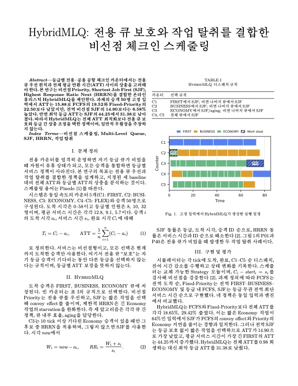
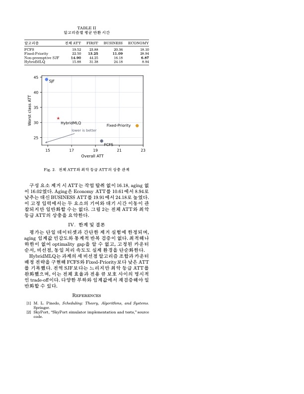

<h1 align="center">SkyPort 체크인 카운터 스케줄러</h1>

<p align="center">
  <b>공항 체크인 카운터를 CPU에 대응시킨 비선점형 다중 프로세서 스케줄링 시뮬레이터</b><br/>
  FCFS · Fixed-Priority · SJF · HybridMLQ 정책을 실행하고 평균 Turnaround Time(ATT)을 비교합니다
</p>

<p align="center">
  
  
  
  
</p>

<p align="center">
  <a href="https://github.com/OS-SkyPort/main">Repository</a> ·
  <a href="https://github.com/OS-SkyPort/.github/blob/main/docs/README.md">Documentation</a>
</p>

---

## 프로젝트 소개

<p align="center">
  
</p>

## 핵심 기능

<p align="center">
  
</p>

## 시스템 아키텍처

<p align="center">
  
</p>

이 구조는 **스케줄링 정책을 쉽게 교체·비교**하고, 시뮬레이션 엔진이 CLI나 GUI 구현에 영향을 받지 않도록 분리하기 위해 선택했습니다.

또한 모든 출력이 동일한 `SimSnapshot`을 사용하므로 인터페이스가 달라도 일관된 결과를 보여주며, 각 구성요소를 독립적으로 테스트하고 확장하기 쉽습니다.

## 실행 화면

<p align="center">
  
</p>

<p align="center">
  <a href="https://github.com/OS-SkyPort/main#실행"><b>웹에서 직접 실행해 보기 →</b></a>
</p>

### 스케줄러

| 키 | 이름 | 설명 |
| --- | --- | --- |
| `fcfs` | FCFS | 도착 순서대로 처리하는 기준 알고리즘 |
| `priority` | Fixed-Priority | FIRST, BUSINESS, ECONOMY 고정 우선순위 기반 처리 |
| `sjf` | Non-preemptive SJF | 비선점형 최단 작업 우선 처리 |
| `hybrid` | HybridMLQ | 등급별 큐, 전용 카운터 우선 배정, SJF 기반 work stealing, Economy aging을 조합한 설계 알고리즘 |

### 제안 알고리즘

HybridMLQ는 등급별 큐 안에서 SJF로 고르고, 전용 카운터가 비면 다른 큐의 최단 작업을 가져오며(work stealing), 10 tick 이상 기다린 Economy 승객을 HRRN으로 끌어올리는(aging) 휴리스틱입니다.

<p align="center">
  
  
</p>

## 실험 결과

`python3 main.py --input <입력> --compare`로 측정한 전체 ATT입니다. 부하는 `총 서비스 시간 / (카운터 5대 × 마지막 도착 시각)`입니다.

| 입력 | 부하 | FCFS | Fixed-Priority | SJF | HybridMLQ |
| --- | --- | --- | --- | --- | --- |
| `input_light.txt` | 0.65 | 7.68 | 7.68 | 7.68 | 7.68 |
| `input.txt` | 1.31 | 19.52 | 22.50 | **14.90** | 15.88 |
| `input_heavy.txt` | 2.61 | 30.90 | 35.16 | **23.68** | 25.02 |

부하 0.65에서는 대기가 없어 네 정책의 ATT가 같습니다. 큐가 쌓이는 부하에서는 SJF가 전체 ATT는 가장 낮지만 FIRST 등급을 44~55까지 굶깁니다. HybridMLQ는 전체 ATT를 SJF보다 1.0~1.3 높이는 대신 FIRST ATT를 13~15 낮춰, 등급 보장과 전체 처리량을 함께 맞춥니다.

## 실행 방법

Python 3.10 이상이면 별도 패키지 설치 없이 실행됩니다.

```bash
python3 main.py --input input.txt --scheduler hybrid   # 단일 정책 실행
python3 main.py --input input.txt --compare            # 정책별 ATT 비교
python3 main.py --input input.txt --web out.html       # 웹 GUI 생성
```

자세한 옵션과 입력 규약은 [실행 문서](https://github.com/OS-SkyPort/main#readme)를 참고합니다.

## 팀 구성

<table>
  <tr><td align="center"><a href="https://github.com/ken-jeong"></a></td><td><b>정상겸</b><br/><sub>Leader · Architecture</sub></td><td>전체 설계 · 시뮬레이션 엔진 · 스케줄러 4종 · 배포</td></tr>
  <tr><td align="center"><a href="https://github.com/eyes25"></a></td><td><b>김준서</b><br/><sub>Docs · Presentation</sub></td><td>프로젝트 문서 관리 · 발표</td></tr>
  <tr><td align="center"><a href="https://github.com/Rustica0411"></a></td><td><b>안현빈</b><br/><sub>Scheduling</sub></td><td>HybridMLQ 알고리즘 개선 · 테스트</td></tr>
</table>
